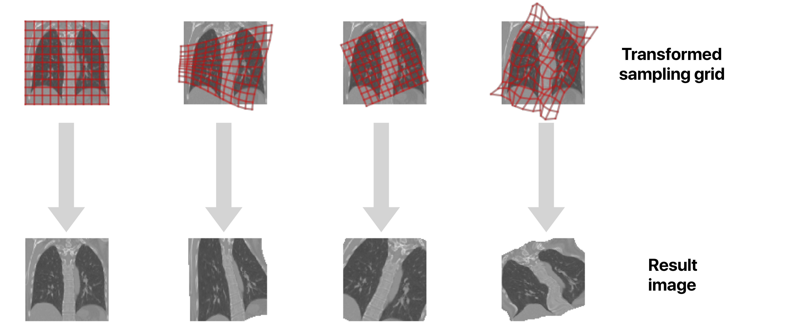

# Gryds: a Python package for geometric transformations of images for data augmentation in deep learning

This package enables you to make fast geometric transformations of images for the purpose of data augmentation in deep learning. The supported geometric transformations are

* Translations
* Rigid transformations (translation + rotation)
* Similarity transformations (translation + rotation + isotropic scaling)
* Affine transformations (translation + rotation + arbitrary scaling + shearing)
* Deformable transformations (modeled as B-splines)

These transformations can be applied to points, sampling grids (hence the name), or interpolator objects that wrap an image. The package has been designed such that images of arbitrary dimensions can be used, but it has only been extensively tested on 2D and 3D images.

The package works with both Python versions 2 (2.6 or higher) and 3. To get a full overview of this package, you can follow the code in the tutorial notebook.


### Citation

If you use this package in academic research, please cite the following paper:

*[K.A.J. Eppenhof and J.P.W. Pluim, Plumonary CT Registration through Supervised Learning with Convolutional Neural Networks, IEEE Transactions on Medical Imaging, 2019](https://www.doi.org/10.1109/TMI.2018.2878316)*

```bibtex
@article{EppenhofPluimTMI2019,
    author={K. A. J. Eppenhof and J. P. W. Pluim}, 
    journal={IEEE Transactions on Medical Imaging}, 
    title={Pulmonary CT Registration through Supervised Learning with Convolutional Neural Networks}, 
    year={2019}, 
    volume={38}, 
    number={5}, 
    pages={1097-1105},
    doi={10.1109/TMI.2018.2878316}, 
}
```

For this paper, we used the code in this repository to create the training set of images.

### Installation

Using `pip`, you can install from this repository:

`pip install git+https://github.com/tueimage/gryds`

The package requires `numpy` and `scipy`. It has been tested on Python 2 with `numpy 1.13.3` and `scipy 0.19.1`, and on Python 3 with `numpy 1.15.4` and `scipy 1.2.0`.

### Tutorial

A Jupyter notebook that covers most of the available transformations and interpolations is available [here](https://nbviewer.jupyter.org/github/tueimage/gryds/blob/master/notebooks/tutorial.ipynb).

### A minimal working example for randomly warping an image

Assuming you have a 2D image in the `image` variable:

```python
import numpy as np
import gryds

# Define a random 3x3 B-spline grid for a 2D image:
random_grid = np.random.rand(2, 3, 3)
random_grid -= 0.5
random_grid /= 5

# Define a B-spline transformation object
bspline = gryds.BSplineTransformation(random_grid)

# Define an interpolator object for the image:
interpolator = gryds.Interpolator(image)

# Transform the image using the B-spline transformation
transformed_image = interpolator.transform(bspline)
```

### Combining multiple transformations

Simply add more transformations in the `transform()` method of the interpolator.
Note that the transformations are applied to the grid, and that the order of the
transformations therefore is reversed when reasoned from the image.

```python
import numpy as np
import gryds

# Define a scaling transformation object
affine = gryds.AffineTransformation(
    ndim=2,
    angles=[np.pi/4.], # List of angles (for 3D transformations you need a list of 3 angles).
    center=[0.5, 0.5]  # Center of rotation.
)

# Define a random 3x3 B-spline grid for a 2D image:
random_grid = np.random.rand(2, 3, 3)
random_grid -= 0.5
random_grid /= 5

# Define a B-spline transformation object
bspline = gryds.BSplineTransformation(random_grid)

# Define an interpolator object for the image:
interpolator = gryds.Interpolator(image)

# Transform the image using both transformations. The B-spline is applied to the
# sampling grid first, and the affine transformation second. From the
# perspective of the image itself, the order will seem reversed (!). See the
# tutorial notebook for details.
transformed_image = interpolator.transform(bspline, affine)
```

### GPU acceleration

Gryds supports GPU acceleration for B-spline interpolation and B-spline transformations. For details, we refer to the GPU-support notebook [here](https://nbviewer.jupyter.org/github/tueimage/gryds/blob/master/notebooks/gpu_support.ipynb).

### Why does Gryds apply the inverse transformation to my images?

Gryds applies the transformation to sampling grids (hence the name) that
are super-imposed on the image. When you apply a transformation to an `Interpolation`
object with the `transform()` method, the *image grid is transformed*. The transformed grid is then used to interpolate the resulting image. For example, if a transformation rotates a grid to anti-clockwise by 45°, the image will be rotated 45° clockwise. The follow example clarifies this:


