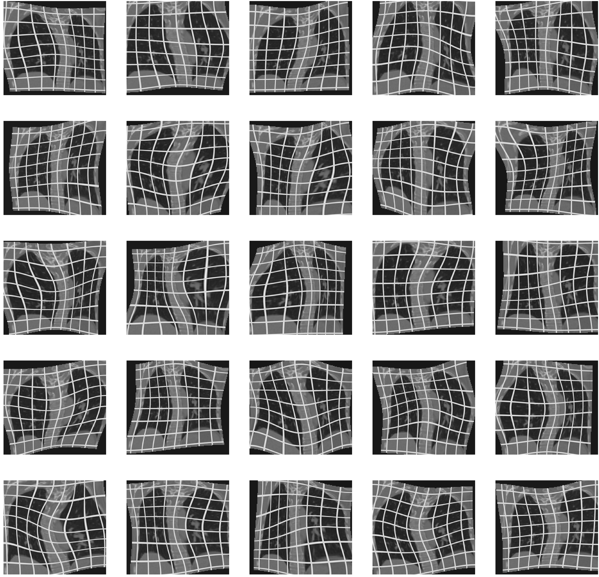

# Spatial transformations for augmentations in deep learning

This library enables you to make fast spatial transformations for the purpose of data augmentation in deep learning. The supported spatial transformations are

* `TranslationTransformtion`
* `LinearTransformation`, supporting
    * Rigid transformations (translation + rotation)
    * Similarity transformations (translation + rotation + isotropic scaling)
    * Affine transformations (translation + rotation + arbitrary scaling + shearing)
* `BSplineTransformation`: deformable transformations for image warping

which can be applied to `Interpolator` objects that wrap an image, and automatically perform (B-spline) interpolation. The library has been designed such that images of arbitrary dimensions can be used, but it has only been extensively tested on 2D and 3D images.

The library works with both Python versions 2 (2.6 or higher) and 3.


### Citation

If you use this library in academic research, please cite the following paper:

K.A.J. Eppenhof and J.P.W. Pluim, Plumonary CT Registration through Supervised Learning with Convolutional Neural Networks, IEEE Transactions on Medical Imaging, 2018


### Installation

Using `pip`, you can install from this repository:

`pip install git+https://github.com/tueimage/Spatial-transformations`

The library requires `numpy` and `scipy`. It has been tested on Python 2 with `numpy 1.13.3` and `scipy 0.19.1`, and on Python 3 with `numpy 1.15.4` and `scipy 1.2.0`.


### A minimal working example for randomly warping an image

Assuming you have a 2D image in the `image` variable:

```python
import numpy as np
import spatial_transformations as tr

# Define a random 3x3 B-spline grid for a 2D image:
random_grid = np.random.rand(2, 3, 3)
random_grid -= 0.5
random_grid /= 5

# Define a B-spline transformation object
bspline = tr.BSplineTransformation(random_grid)

# Define an interpolator object for the image:
interpolator = tr.Interpolator(image)

# Transform the image using the B-spline transformation
transformed_image = interpolator.transform(bspline)
```


